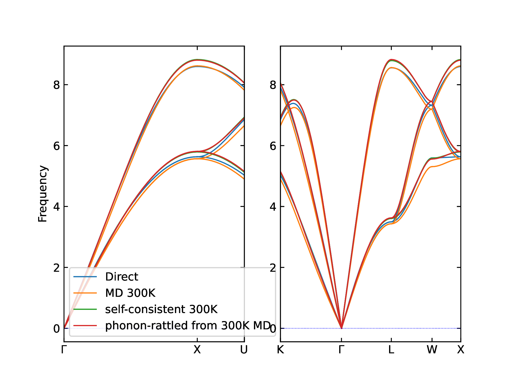
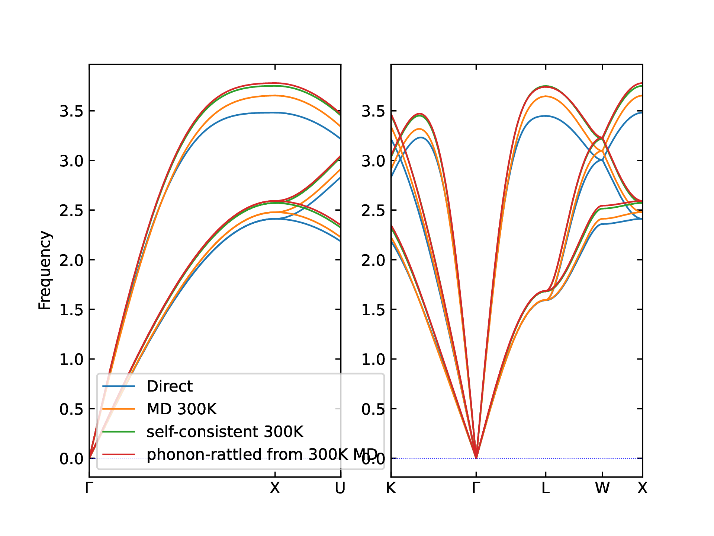

A little sandbox for testing some interactions between hiphive, phonopy and ASAP3

I noticed some odd results when trying out the self-consistent
phonons: here we create a clean environment and recipe to see what can
be reproduced and investigated further.

Effective harmonic potentials are created using EMT by the following methods:

- direct displacements along degrees of freedom (i.e. standard Phonopy calculation, no temperature)
- sampling from molecular dynamics
- self-consistent phonon-rattling
- phonon-rattling with the first model and sampling this distribution

For aluminium, the temperature effect seems to be reversed between MD sampling and phonon rattling. For gold, the temperature effect is about halved between MD sampling and phonon rattling. In both cases, phonon rattling from the MD force constants gives similar results to self-consistent phonon rattling.

It seems that despite similar statistics in the displacement distances, MD is sampling a very different potential energy surface from phonon rattling? I have `QM_statistics=False` so would expect these to be similar ensembles.

### Aluminium 300K comparison

### Gold 300K comparison

